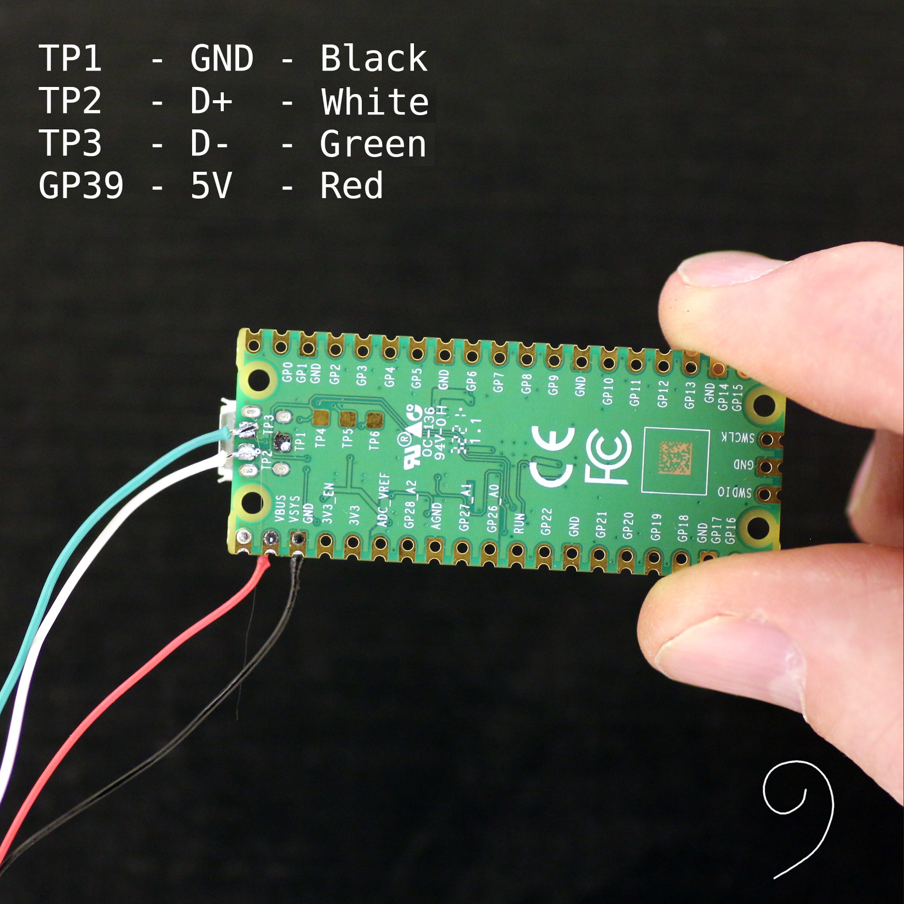

# The Art Light

## Radar Sensor LD2410

- [Arduino Library to HiLink-LD2410](https://github.com/Renstec/LD2410)

## USB

Pico |Pin   |USB cable|Color
-----|------|---------|------
TP1  |GND   |Gnd      |Black
TP2  |USB DM|Data-    |White
TP3  |USB DP|Data+    |Green
PIN39|VSYS  |5V       |Red
PIN40|VBUS  |5VD

## Links

- [An Arduino library for the Hi-Link LD2410 24Ghz FMCW radar sensor](https://github.com/ncmreynolds/ld2410)
- [Protocol implementation for HLK-LD303 radar module](https://github.com/bertrik/hlk-ld2410) c++
- [LD2410 Threaded python driver](https://github.com/ed-french/LD2410-python-driver)
- [Getting started with ESP32 and Firebase](https://medium.com/firebase-developers/getting-started-with-esp32-and-firebase-1e7f19f63401)
